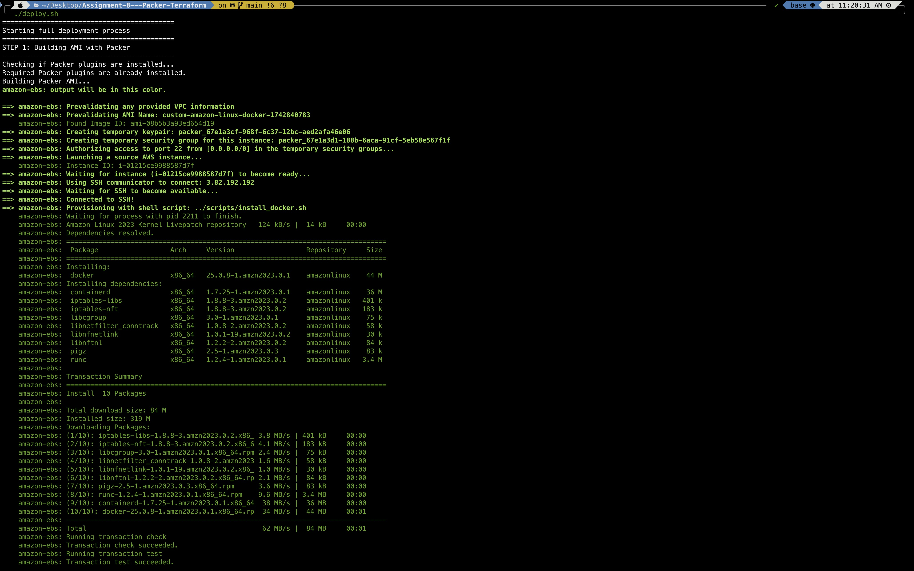
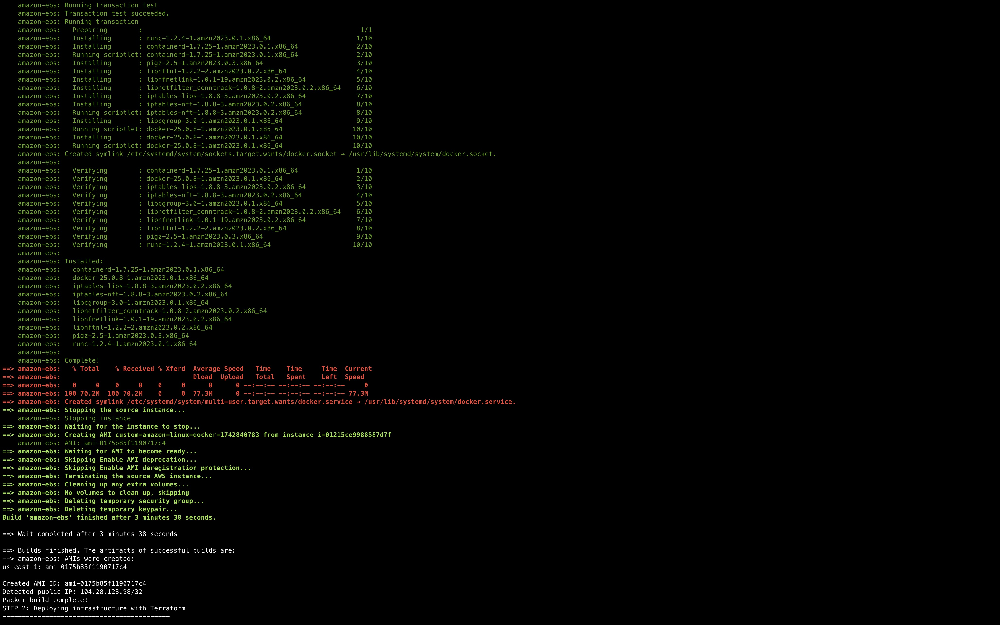
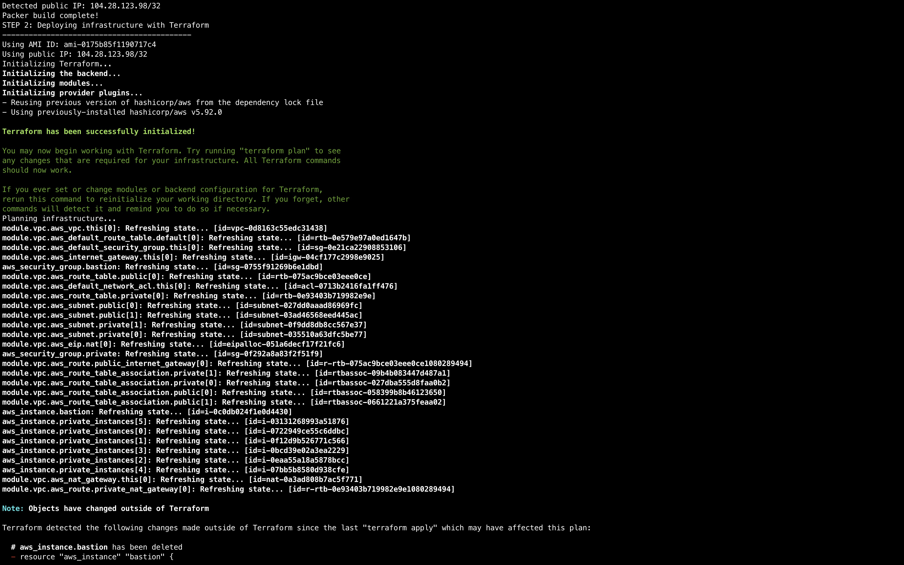
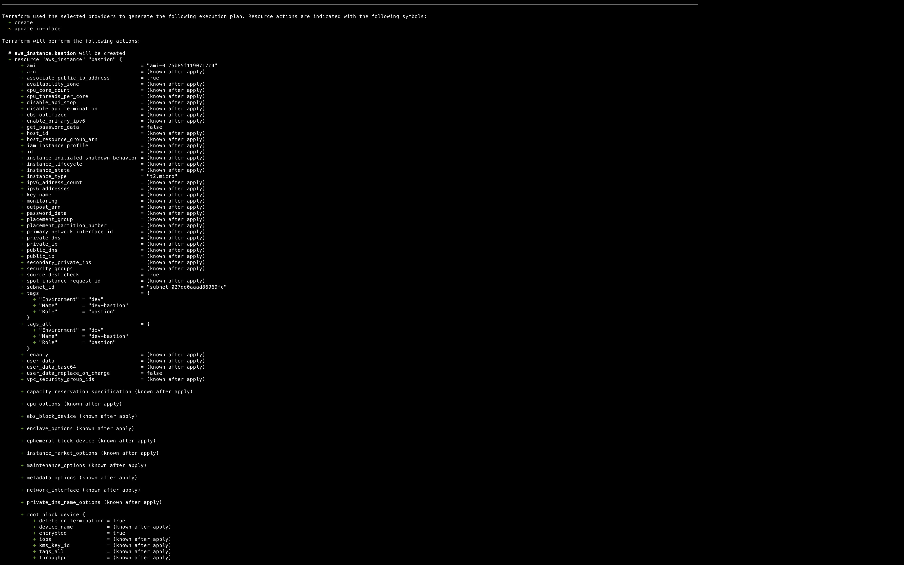
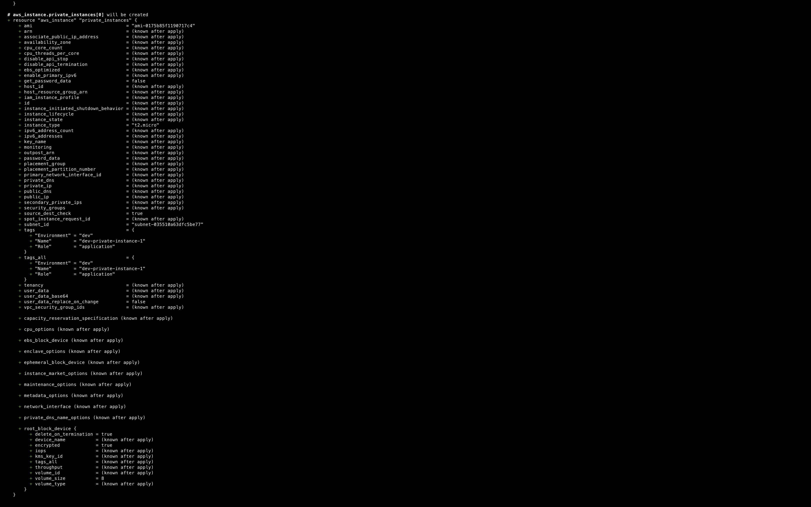
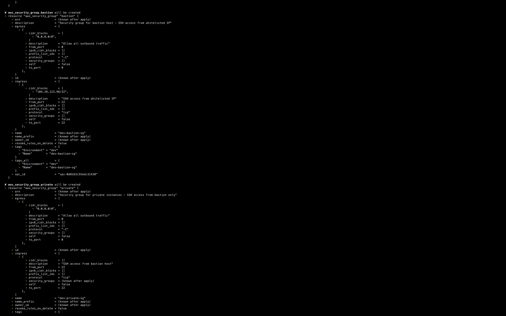
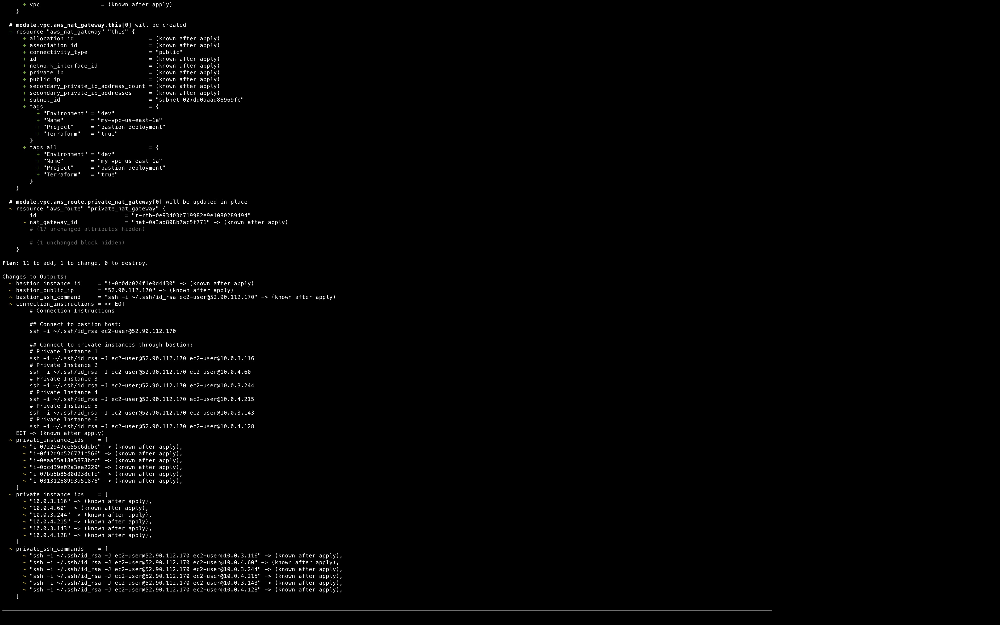
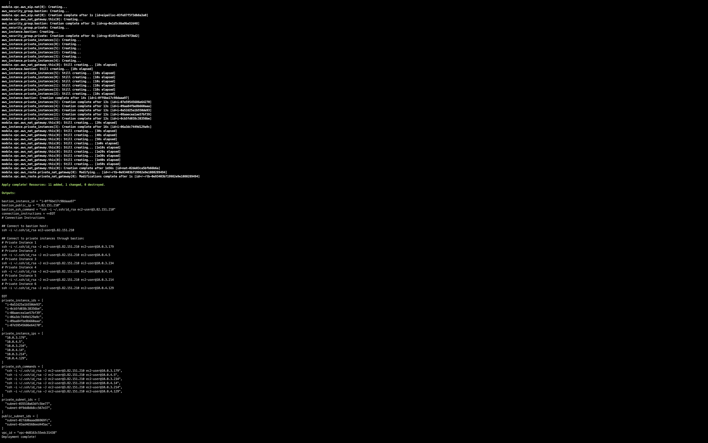
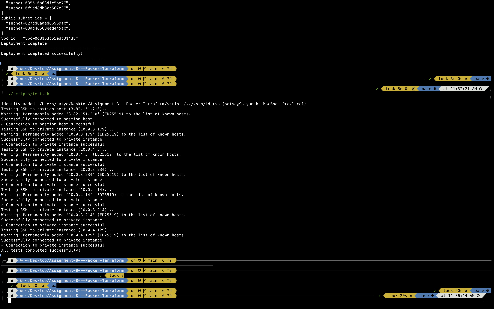

# Assignment-8---Packer-Terraform

This repository automates the creation of an AWS environment using:
1. **Packer** to build a custom Amazon Linux AMI with Docker installed.
2. **Terraform** to provision a VPC, a bastion host, and several private EC2 instances using that AMI.
3. **Shell scripts** to streamline building, deploying, testing, and destroying the environment.

---

## Repository Structure

```
.
├── Images/
│   ├── Output1.jpg
│   ├── Output2.jpg
│   ├── Output3.jpg
│   ├── Output4.jpg
│   ├── Output7.jpg
│   ├── Packer1.jpg
│   ├── Packer2.jpg
│   ├── TerraApply1.jpg
│   ├── TerraInit1.jpg
│   ├── TerraPlan1.jpg
│   ├── TerraPlan2.jpg
│   ├── TerraPlan3.jpg
│   ├── TerraPlan4.jpg
│   └── Tests.jpg
├── README.md
├── build_ami.sh
├── deploy.sh
├── deploy_infra.sh
├── packer/
│   ├── amazon-linux.json
├── scripts/
│   ├── destroy.sh
│   ├── install_docker.sh
│   └── test.sh
└── terraform/
    ├── main.tf
    ├── outputs.tf
    ├── variables.tf
    └── versions.tf
```

1. **Images/** – Folder containing all my screenshots.  
2. **build_ami.sh** – Builds the custom AMI with Packer.  
3. **deploy_infra.sh** – Deploys the AWS infrastructure with Terraform.  
4. **deploy.sh** – A convenience script that calls both `build_ami.sh` and `deploy_infra.sh`.  
5. **scripts/** – Additional scripts:
   - **destroy.sh** – Destroys all Terraform-managed infrastructure.
   - **install_docker.sh** – Installs Docker (called during Packer build).
   - **test.sh** – SSH test script to confirm access to bastion and private instances.
6. **packer/** – Packer templates (i.e., `amazon-linux.json`).  
7. **terraform/** – Terraform configuration files (`main.tf`, `outputs.tf`, `variables.tf`, etc.).  

---

## Prerequisites

1. **Install Packer and Terraform** (for macOS users with Homebrew):
   ```bash
   brew tap hashicorp/tap
   brew install hashicorp/tap/terraform
   brew install hashicorp/tap/packer
   ```

2. **AWS Credentials** (environment variables stored in your AWS CLI config).  

3. **Packer** installed (v1.8+ recommended).  

4. **Terraform** installed (v1.3+ recommended).  

5. **bash** shell to run the provided scripts (Linux, macOS, or a Cloud9 environment).

---

## Step-by-Step Guide

Below is a walkthrough of the deployment process. The referenced images illustrate various outputs and confirmations.

### 1. Configure AWS Credentials

Create (or update) a `.env` file in the project root. For example:

```bash
export AWS_ACCESS_KEY_ID="YOUR_ACCESS_KEY"
export AWS_SECRET_ACCESS_KEY="YOUR_SECRET_KEY"
export AWS_SESSION_TOKEN="YOUR_SESSION_TOKEN"
export AWS_DEFAULT_REGION="us-east-1"
```

Then run:

```bash
source .env
```

---

### 2. Set Execute Permissions on Scripts

Before running any scripts, make sure they have executable permissions:

```bash
chmod +x build_ami.sh deploy_infra.sh deploy.sh
chmod +x scripts/*.sh
```

---

### 3. Build the AMI with Packer

You can run the full deployment with a single command:

```bash
./deploy.sh
```

- **OR** run the steps separately:
  1. `./build_ami.sh` – Builds the custom AMI with Packer and saves the AMI ID to `ami_id.txt`, plus your IP to `my_ip.txt`.
  2. `./deploy_infra.sh` – Deploys the Terraform infrastructure using those values and runs the SSH test.

#### Packer Build Screenshots

- **Packer1.jpg** – Shows the beginning of the Packer build, validating the source AMI, creating temporary resources, etc.  
  

- **Packer2.jpg** – Shows a successful completion of the Packer build, including the final AMI ID.  
  

---

### 4. Initialize and Plan Terraform

When you run `./deploy_infra.sh` (or just `./deploy.sh`), Terraform will:
1. **Initialize** (`terraform init`) – downloads necessary providers.  
2. **Plan** (`terraform plan`) – shows the resources that will be created.  
3. **Apply** (`terraform apply -auto-approve`) – creates the VPC, subnets, NAT gateway, bastion, and private instances using your newly built AMI.

#### Terraform Screenshots

- **TerraInit1.jpg** – Example of Terraform initialization.  
  

- **TerraPlan1.jpg**, **TerraPlan2.jpg**, **TerraPlan3.jpg**, **TerraPlan4.jpg** – Examples of Terraform plan output, listing resources to create.  
    
    
    
  

- **TerraApply1.jpg** – Example of Terraform apply output, confirming successful creation of resources.  
  

---

### 5. Inspecting Outputs

When Terraform finishes, it prints out various outputs:

- **Bastion Public IP**  
- **Private Instance IPs**  
- **VPC ID**  
- **SSH Commands** (for convenience)

These help you verify the environment is set up as intended.

Some sample output might look like:

```
bastion_public_ip = "XX.XX.XX.XX"
private_instance_ips = [
  "10.0.3.116",
  "10.0.4.60",
  ...
]
```

---

### 6. Testing SSH Connectivity

After deployment, you can run the test script to verify connectivity:

```bash
./scripts/test.sh
```

This script:
1. Uses the **generated SSH key** in `.ssh/id_rsa` (created during Packer build).  
2. Attempts an SSH connection to the **bastion** host.  
3. Proxy-jumps to each private instance to confirm connectivity.

- **Tests.jpg** – shows the script output verifying successful SSH connections.  
  

If you see `Operation timed out` or `Permission denied`, ensure:
- The **Security Group** inbound rule for SSH matches your current public IP.  
- Your local `.ssh/id_rsa` file has `chmod 600`.  
- The instance is running and has the public IP you expect.

---

### 6. View AWS Resources on Dashboard

- **Output1.jpg** / **Output2.jpg** / **Output3.jpg** / **Output4.jpg** / **Output7.jpg** – These screenshots show the AWS resources created in the AWS Management Console dashboard, including:
  - EC2 instances (bastion and private instances)
  - Elastic IP Address (Bastion)
  - Volumes
  - Snapshot
  - AMI

These images provide visual confirmation that our resources were successfully deployed in the AWS environment.

---

### 7. Destroying Resources

When you're finished, run:

```bash
./scripts/destroy.sh
```

This script does the following:
1. Reads the **packer.log** to re-discover the AMI ID (in case you need it).  
2. Gets your current IP.  
3. Calls `terraform destroy -auto-approve` with those values.  
4. Tears down all AWS resources created by Terraform: the VPC, bastion, private EC2 instances, NAT gateway, etc.

---

## Troubleshooting Tips

1. **Changing Public IP** – If your ISP assigns a new IP, you may need to update the bastion's security group rule or re-run with the new IP.   
2. **Packer / Terraform Credentials** – Double-check your `.env` file. If Terraform complains about missing credentials, rename your env vars to `AWS_ACCESS_KEY_ID`, `AWS_SECRET_ACCESS_KEY`, etc.

---

## Conclusion

By following these steps:

1. **Build** a Docker-ready AMI with Packer,  
2. **Deploy** your AWS environment with Terraform,  
3. **Test** SSH connectivity to your bastion and private instances,  
4. **Tear down** resources with a single script when we're done,

we can quickly create a secure, repeatable infrastructure. The included screenshots in the **Images** folder provide a visual reference for each step.