Below is a **comprehensive README.md** that references **every screenshot** you listed. Adjust any file paths or screenshot names if they differ in your actual directory structure.

---

# AWS Infrastructure with Custom AMI and Terraform Provisioning

This repository provides a complete end-to-end demonstration of creating AWS infrastructure via **Terraform** and then configuring EC2 instances using **Ansible**. The infrastructure comprises:

- **1 Bastion Host** (Amazon Linux) that doubles as the Ansible Controller  
- **6 Private EC2 Instances** (3 Ubuntu, 3 Amazon Linux)

After infrastructure creation, Ansible:
- Updates and upgrades packages (apt on Ubuntu, yum on Amazon Linux)
- Installs and starts the latest Docker
- Displays Docker version
- Reports disk usage (via `df -h`)

---

## 1. Overview of the Project

### Terraform

- **VPC** with public and private subnets
- **NAT Gateway** and route tables for outbound access
- **Security Groups** restricting SSH to your IP for the bastion and private traffic for the instances
- **Bastion Host** in a public subnet (accessible only from your IP on port 22)
- **6 Private EC2 instances** (3 Ubuntu, 3 Amazon Linux), each tagged accordingly

### Ansible

- Dynamically discovers the 6 private instances using the AWS EC2 inventory plugin
- Updates packages, installs Docker, verifies Docker version, and prints disk usage

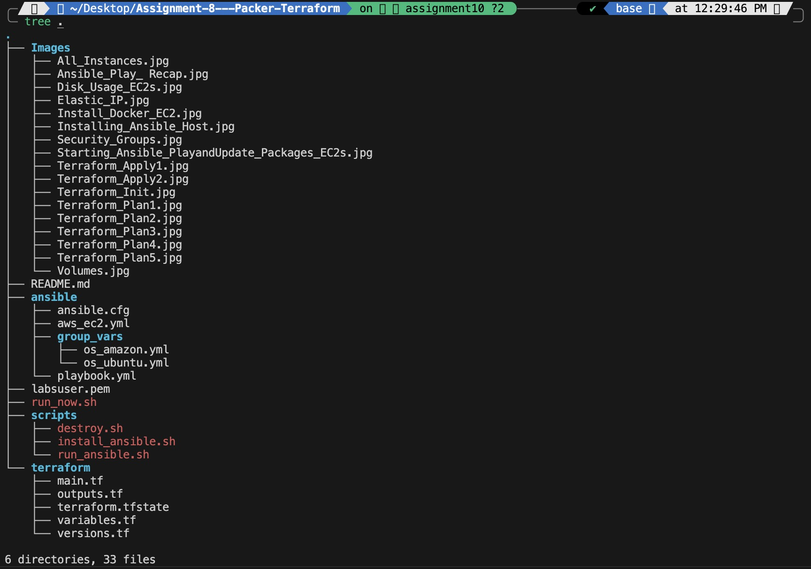

---

## 2. Repository Structure

```
.
├── Images/
│   ├── All_Instances.jpg
│   ├── Ansible_Play_ Recap.jpg
│   ├── Diectory_Structure.jpg
│   ├── Disk_Usage_EC2s.jpg
│   ├── Elastic_IP.jpg
│   ├── Install_Docker_EC2.jpg
│   ├── Installing_Ansible_Host.jpg
│   ├── Key_help.jpg
│   ├── Security_Groups.jpg
│   ├── Starting_Ansible_PlayandUpdate_Packages_EC2s.jpg
│   ├── Terraform_Apply1.jpg
│   ├── Terraform_Apply2.jpg
│   ├── Terraform_Init.jpg
│   ├── Terraform_Plan1.jpg
│   ├── Terraform_Plan2.jpg
│   ├── Terraform_Plan3.jpg
│   ├── Terraform_Plan4.jpg
│   ├── Terraform_Plan5.jpg
│   └── Volumes.jpg
├── ansible/
│   ├── ansible.cfg
│   ├── aws_ec2.yml
│   ├── group_vars/
│   │   ├── os_amazon.yml
│   │   └── os_ubuntu.yml
│   └── playbook.yml
├── scripts/
│   ├── destroy.sh
│   ├── install_ansible.sh
│   └── run_ansible.sh
├── terraform/
│   ├── main.tf
│   ├── outputs.tf
│   ├── variables.tf
│   └── versions.tf
├── run_now.sh
├── labsuser.pem  (not typically committed)
├── .env          (not typically committed)
└── README.md      (this file)
```

> **Note**:  
> - The `.env` file holds your AWS credentials and path to your SSH key.  
> - `labsuser.pem` is your private key for SSH (do **not** commit it).  
> - The screenshots shown above reside in the `Images` folder.

---

## 3. Prerequisites

1. **AWS Credentials** (Access Key, Secret Key, Session Token if required)  
2. **Terraform** (v1.3+ recommended)  
3. **SSH Key** (`labsuser.pem`) with correct permissions (e.g., `chmod 400 labsuser.pem`)  
4. **(Optional) Ansible** installed locally if you’d like, but the scripts will install Ansible on the bastion host automatically.

---

## 4. Setup Instructions

### 4.1 Create and Source Your `.env` File

1. **Clone** this repository (switch to your assignment branch if needed):
   ```bash
   git clone -b assignment10 https://github.com/<YOUR_USERNAME>/<YOUR_REPO>.git
   cd <YOUR_REPO>
   ```

2. **Create a `.env`** file in the root folder with your AWS credentials and the path to your SSH key:

   ```bash
   # .env
   export AWS_ACCESS_KEY="YOUR_ACCESS_KEY"
   export AWS_SECRET_KEY="YOUR_SECRET_KEY"
   export AWS_SESSION_TOKEN="YOUR_SESSION_TOKEN"   # If applicable
   export AWS_REGION="us-east-1"
   export SSH_KEY_PATH="/absolute/path/to/labsuser.pem"
   ```

3. **Make scripts executable** (on Linux/macOS):
   ```bash
   chmod +x run_now.sh
   chmod +x scripts/*.sh
   ```

---

### 4.2 Run the Main Script

Run the `run_now.sh` script to:

1. **Initialize and apply Terraform** (creating VPC, subnets, bastion, private instances)
2. **Install Ansible** on the bastion host
3. **Run the Ansible playbook** to set up Docker and display disk usage

```bash
./run_now.sh
```

#### Terraform in Action

1. **Terraform Init**  
   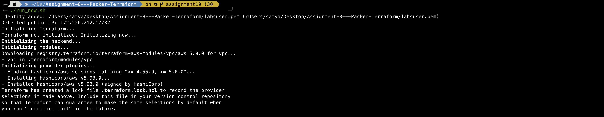

2. **Terraform Plan**  
   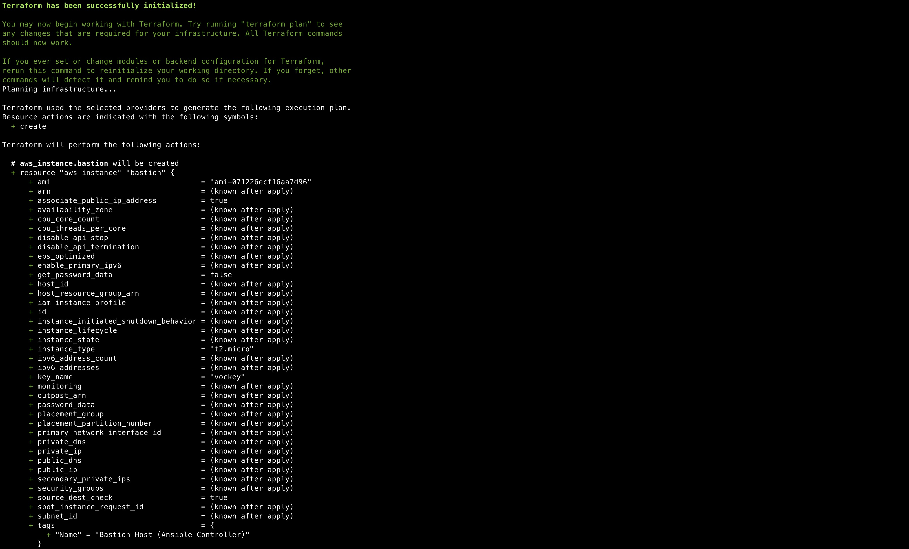  
   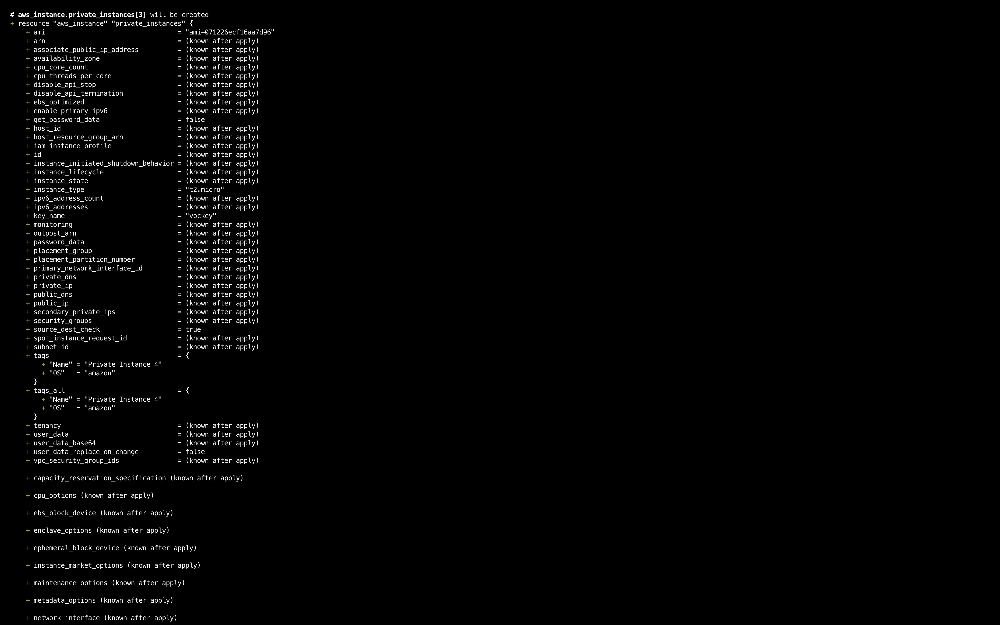  
   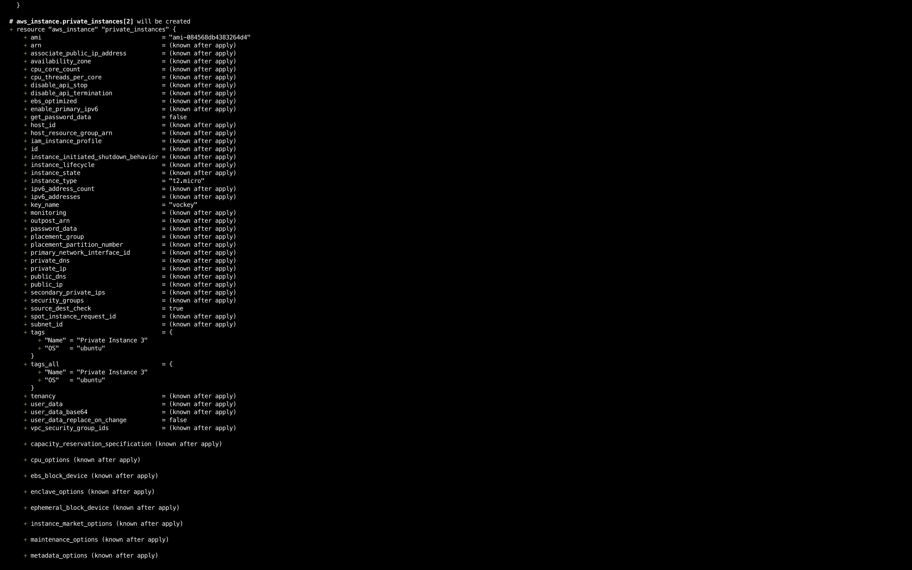  
   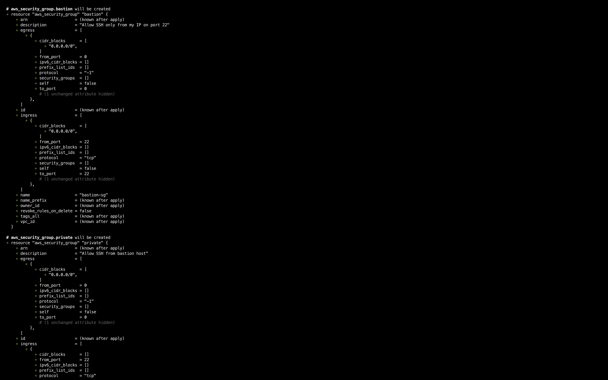  
   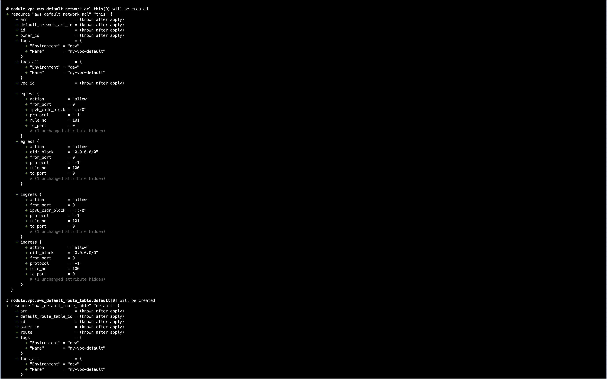

3. **Terraform Apply**  
   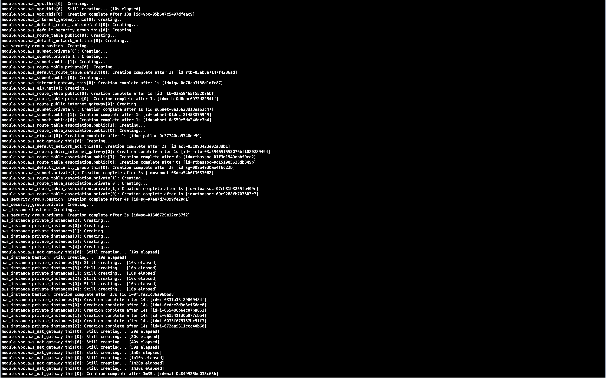  
   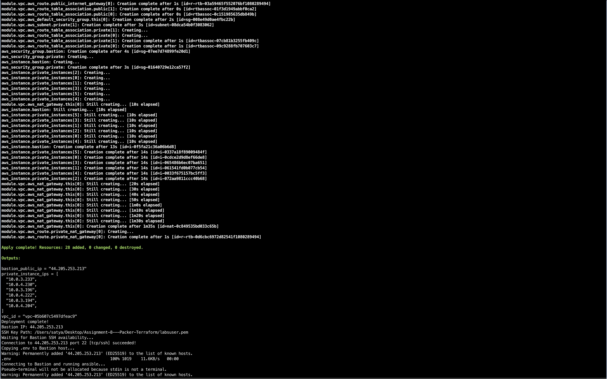

When Terraform finishes, it outputs the bastion’s public IP and the private IPs of the 6 EC2 instances.

---

### 4.3 Ansible Playbook Execution

After Terraform completes, the script automatically:

1. **Copies** your `.env` file to the bastion
2. **Installs Git & Ansible** on the bastion
3. **Runs** the Ansible playbook (`playbook.yml`) against all 6 private EC2s

#### Ansible Steps

1. **Installing Ansible on Bastion**  
   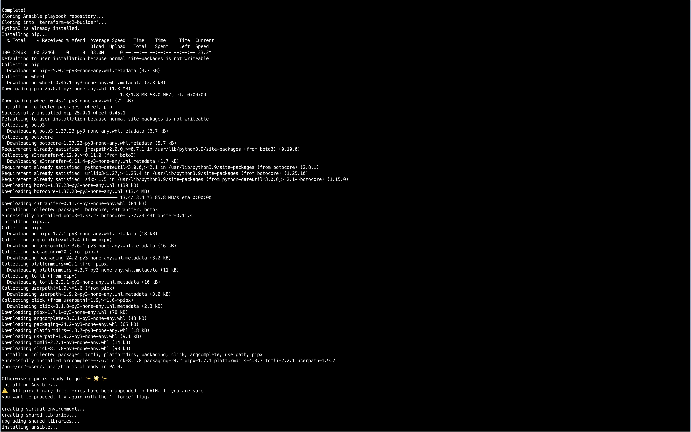

2. **Starting the Ansible Play & Updating Packages**  
   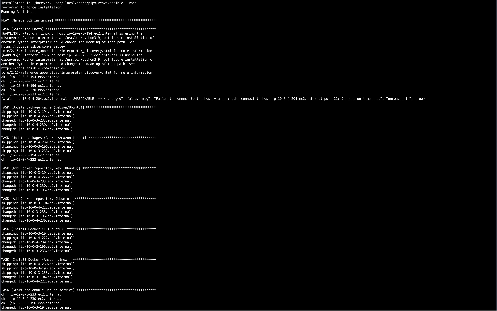

3. **Installing Docker on EC2**  
   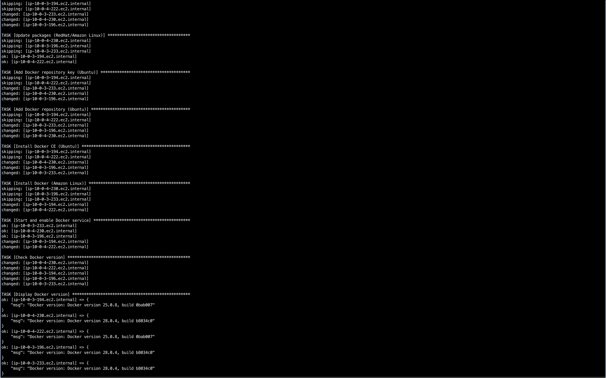

4. **Verifying Docker & Disk Usage**  
   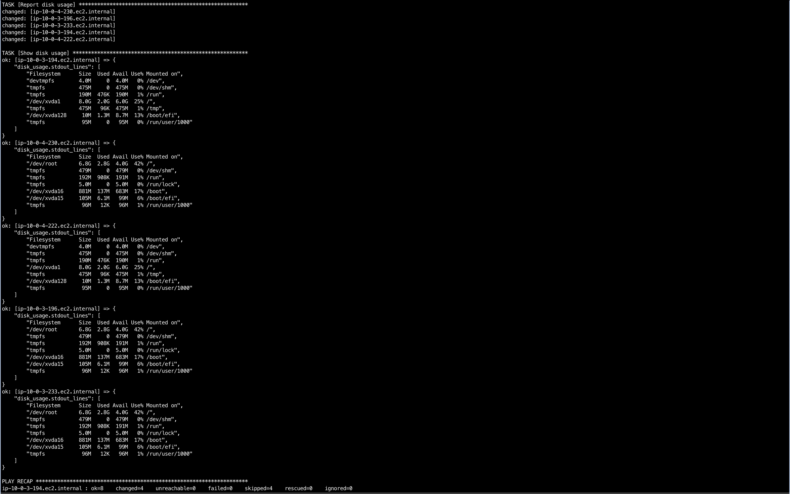

5. **Recap of the Ansible Run**  
   

You should see a summary showing each of the 6 private instances has updated packages, Docker installed, and disk usage displayed.

---

## 5. AWS Console Verification

You can verify in the AWS console that:

1. **All Instances**: 1 Bastion + 6 Private  
   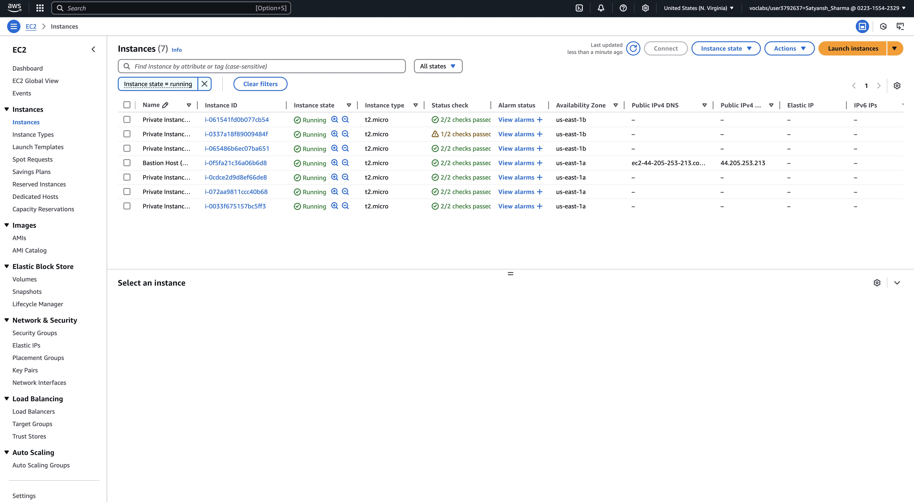

2. **Security Groups** created by Terraform  
   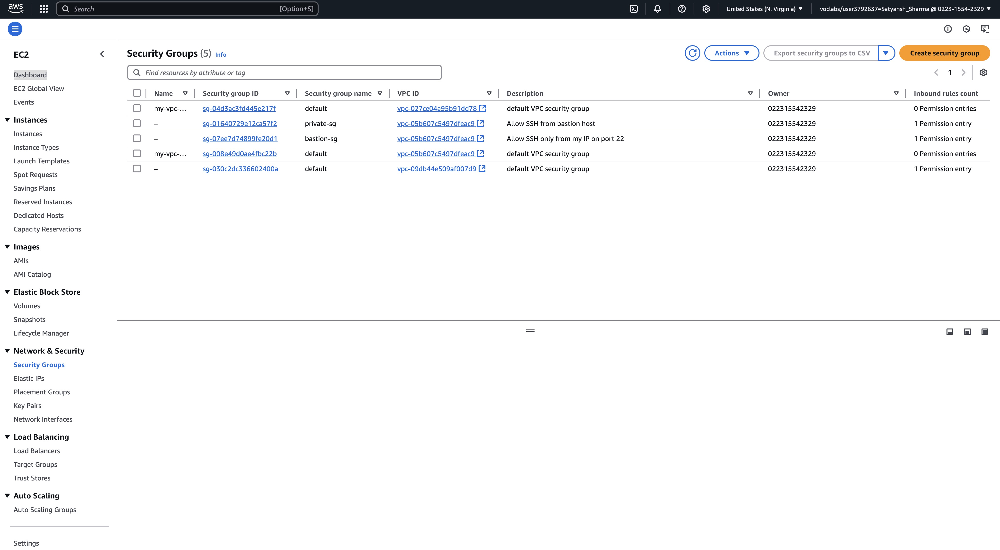

3. **Elastic IP** assigned to the Bastion  
   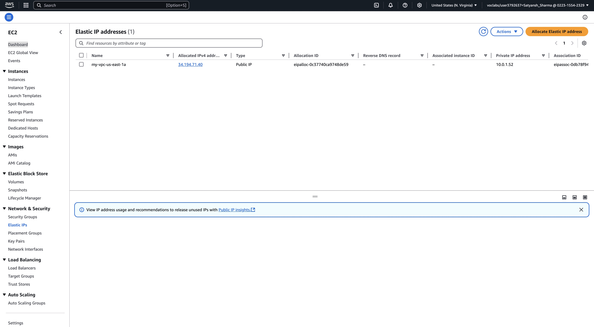

4. **Volumes** for each EC2  
   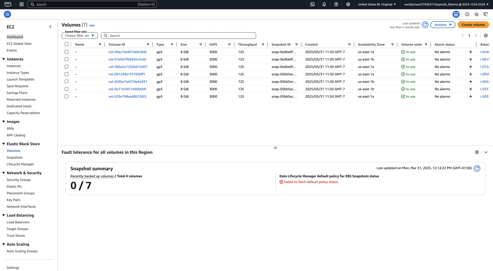

5. **Key Download Help** (if you needed guidance from AWS Academy)  
   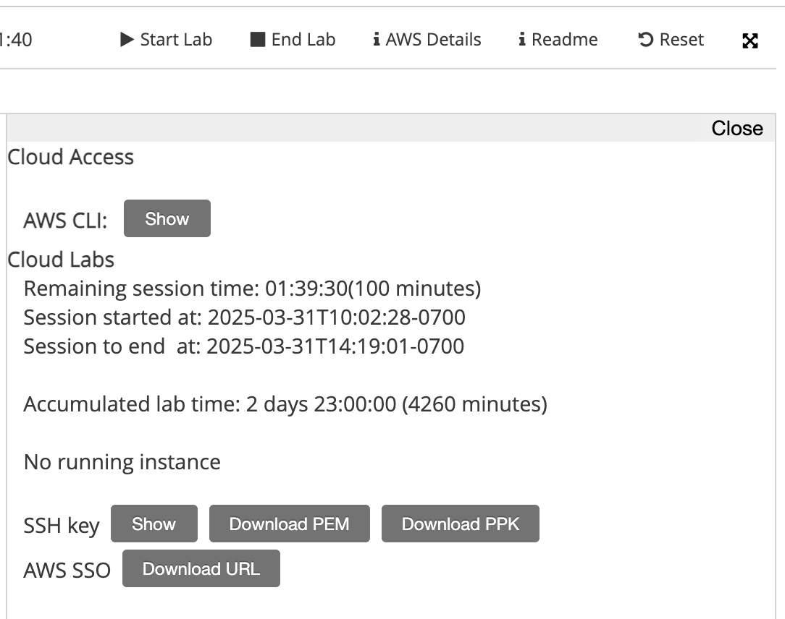

---

## 6. Destroying Resources

To **avoid incurring costs**, you can remove all AWS resources by running:

```bash
./scripts/destroy.sh
```

Make sure you run this from the project root so relative paths work correctly. This will:

1. Source the `.env` file
2. Execute `terraform destroy -auto-approve`
3. Tear down all your AWS infrastructure (VPC, EC2s, NAT, etc.)

---

## 7. Conclusion

### Summary of What You Get

- **7 EC2 Instances** total:
  - **1 Bastion Host** (Ansible Controller)
  - **6 Private Instances** (3 Ubuntu + 3 Amazon Linux)  
- **Docker** installed & running on all 6 private instances
- **Disk usage** & **Docker version** verified via Ansible
- **Security** via private subnets & minimal Bastion exposure

This setup demonstrates a fully automated pipeline:
1. **Terraform** for provisioning core AWS infrastructure
2. **Ansible** for remote configuration management

---

**Thank you for checking out this project!** Feel free to customize the code, adjust AMI IDs, or modify instance types for your own AWS environment. If you have any questions or improvements, please submit a pull request or open an issue.

Enjoy your automated AWS environment!